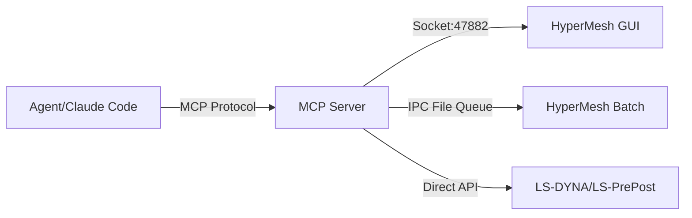
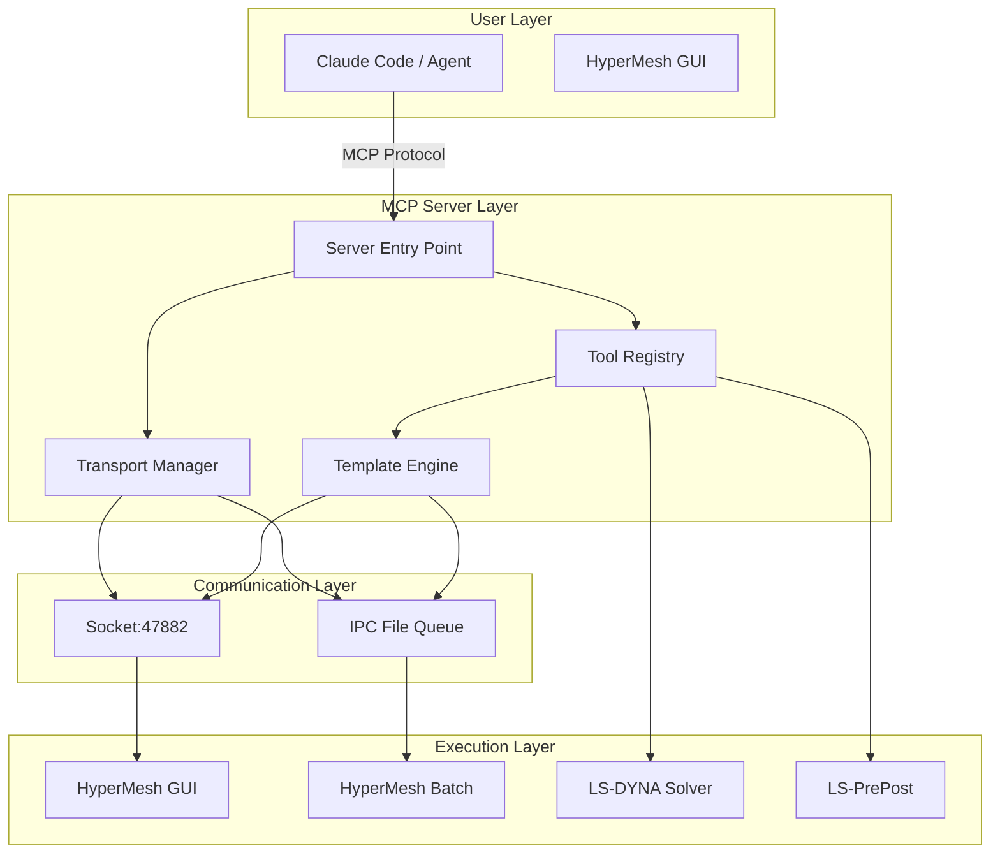

# 🏗️ Hyper-Dyna-MCP

<p align="center">
  <a href="./README.md"></a>
  <a href="./README.en.md"></a>
  <a href="./LICENSE"></a>
  <a href="https://github.com/hyper-dyna-mcp/releases"></a>
</p>

**Hyper-Dyna-MCP** is an **MCP (Model Context Protocol)** based CAE workflow automation server, bridging natural language planning with **HyperMesh** pre-processing, **LS-DYNA** keyword file handling, and **LS-PrePost** post-processing.

> 🎯 **Core Goal**: Enable engineers to automatically complete complex CAE pre-processing workflows through natural language descriptions.


## ✨ Features

- 📚 **1935 LS-DYNA keyword templates** — MAT, SECTION, CONTACT, BOUNDARY, LOAD, CONTROL, DATABASE, SET, etc.
- 🔗 **HyperMesh GUI integration** — Socket communication (port 47882) + IPC file queue dual-channel
- 📝 **K file export** — Export LS-DYNA .k keyword files from HyperMesh models
- 🔧 **Model operations** — Read/write materials, properties, components, sections
- 🛡️ **Safety policies** — Tcl script policy enforcement, MCP_SCRIPT markers, command-by-command execution
- 🔄 **Workflow orchestration** — LS-DYNA, HyperMesh, and mixed pipelines

## 🧩 Interface Types

### MCP Protocol Interface

This project implements the standard **MCP (Model Context Protocol)** protocol, supporting:

- **Tools** — 18 professional CAE tools
- **Prompts** — Workflow planning, execution, validation
- **Resources** — Path configuration, environment information

### Communication Interfaces



## 📦 Installation

### Requirements

- **Python**: 3.11+ (recommended 3.13)
- **HyperMesh**: 2021+
- **LS-DYNA**: R13+
- **LS-PrePost**: 4.8+
- **Conda**: For environment management

### Quick Installation (Recommended)

Use the batch installation script to automatically configure all paths:

```bash
# Windows
install.bat

# Linux/macOS
chmod +x install.sh
./install.sh
```

Or use the interactive configuration wizard:

```bash
python batch/setup_wizard.py
```

### Manual Installation

#### 1️⃣ Clone Repository

```bash
git clone https://github.com/your-username/hyper-dyna-mcp.git
cd hyper-dyna-mcp
```

#### 2️⃣ Create Conda Environment

```bash
conda create -n hyper-dyna python=3.13
conda activate hyper-dyna
```

#### 3️⃣ Install Dependencies

```bash
# Install project dependencies
pip install -e .

# Or install development dependencies
pip install -e ".[dev]"
```

#### 4️⃣ Configure Paths

Edit `path/local_paths.yaml`:

```yaml
project:
  root: "."
  conda_env: "hyper-dyna"
  python_exe: "E:/anaconda3/anzhuang/envs/hyper-dyna/python.exe"
```

#### 5️⃣ Verify Installation

```bash
# Run tests
pytest

# Check environment
python -c "from program.server import main; print('✅ MCP Server ready')"
```

## 🚀 Usage

### Method 1: Direct MCP Server Startup

```bash
# Start MCP server
python -m program.server
```

### Method 2: Via HyperMesh GUI

1. **Double-click** `start_mcp.bat`
2. **Open HyperMesh GUI**
3. **Execute in HyperMesh Tcl console**:
   ```tcl
   source hmcustom.tcl
   mcp_start
   ```
4. **Or**: HyperMesh → MCP tab → Click "Start MCP" button

### HyperMesh Commands

`hmcustom.tcl` provides the following commands:

| Command | Description |
|---------|-------------|
| `mcp_start` | Start MCP listener (calls `runs/mcp.tcl`) |
| `mcp_loop` | Start IPC file loop (calls `python -m program.plugin_loop`) |
| `mcp_status` | Check socket and IPC status |
| `mcp_stop` | Stop IPC loop (writes `ipc/stop.flag`) |
| `mcp_create_tab` | Create MCP GUI tab (auto-executed) |

### Startup Methods

The project provides two independent startup methods:

**Method A: Socket Listener**
- Command: `mcp_start`
- Function: Start HyperMesh built-in socket server, listening on port 47882
- Use case: Real-time communication with MCP server

**Method B: IPC File Loop**
- Command: `mcp_loop`
- Function: Start Python script, polling `ipc/commands/` directory to process commands
- Use case: Batch processing mode or when socket is unavailable

### Method 3: Claude Code Integration

Use MCP tools directly in Claude Code:

```
User: Help me create a concrete column LS-DYNA model
Claude: I'll use Hyper-Dyna-MCP tools to create the model for you...
```

## 🔧 MCP Tools List

### Core Tools (18)

| Tool Name | Description | Interface Type |
|-----------|-------------|----------------|
| `hm_set_keyword` | Set LS-DYNA keyword | Socket/IPC |
| `hm_keyword_help` | Get keyword help | Local query |
| `hm_check_model` | Query current model state | Socket/IPC |
| `hm_convert_model` | Convert model to LS-DYNA format | Socket/IPC |
| `hm_read_materials` | Read all materials | Socket/IPC |
| `hm_read_components` | Read all components | Socket/IPC |
| `execute_tcl_gui` | Execute Tcl in HyperMesh GUI | Socket |
| `execute_hmbatch` | Execute via hmbatch.exe | IPC |
| `generate_tcl_script` | Generate Tcl script | Local generation |
| `check_hypermesh_connection` | Check hmbatch.exe connection | Local check |
| `parse_k_file` | Parse .k file | Local parsing |
| `write_k_file` | Generate .k file | Local generation |
| `generate_lsdyna_command` | Generate solver command (dry_run) | Local generation |
| `parse_solver_log` | Parse solver log | Local parsing |
| `execute_lsprepost` | Execute LS-PrePost cfile | Direct call |
| `generate_cfile` | Generate cfile script | Local generation |
| `generate_post_processing_cfile` | Generate post-processing cfile | Local generation |
| `check_environment` | Check Python/conda/packages | Local check |
| `load_path_config` | Load YAML config | Local loading |
| `validate_path` | Check path exists | Local check |

## 🏗️ Project Structure

```
hyper-dyna-mcp/
├── 📁 program/                    # MCP server core
│   ├── 🐍 server.py              # MCP entry point (18 tools)
│   ├── 🔄 transport_manager.py   # Socket/IPC dual-channel management
│   ├── 📨 plugin_loop.py         # IPC command dispatcher
│   └── 🛠️ tools/                 # 24 tool modules
│       ├── hm_gui.py             # HyperMesh GUI communication
│       ├── hm_runner.py          # HyperMesh batch processing
│       ├── k_parser.py           # K file parser
│       ├── k_writer.py           # K file generator
│       └── ...                   # Other tools
├── 📁 templates/keyword/         # 1935 Tcl templates
│   ├── mat/                      # Material templates
│   ├── section/                  # Section templates
│   ├── contact/                  # Contact templates
│   └── ...                       # Other keywords
├── 📁 path/                      # YAML configuration files
├── 📁 tests/                     # 132 tests
├── 📁 docs/                      # Documentation
├── 📁 output/                    # Generated model files
├── 📄 hmcustom.tcl               # HyperMesh auto-load script
└── 📄 pyproject.toml             # Project configuration
```

## 📊 Technical Architecture



## 📈 Performance Metrics

- **Keyword templates**: 1935
- **Tool count**: 18
- **Test coverage**: 132 test cases
- **Connection latency**: Socket < 10ms, IPC < 500ms
- **Model processing**: Supports 100MB+ .k files

## 🧪 Testing

```bash
# Run all tests
pytest

# Run specific tests
pytest tests/test_minimum_model.py

# Generate coverage report
pytest --cov=program --cov-report=html
```

## 📚 Documentation

- 📖 [API Documentation](./docs/api.md)
- 🏗️ [Architecture Design](./docs/architecture.md)
- 🔧 [Tool Reference](./docs/tools.md)
- 📝 [Example Workflows](./docs/examples.md)

## 🤝 Contributing

Contributions are welcome! Please follow these steps:

1. Fork the repository
2. Create a feature branch (`git checkout -b feature/amazing-feature`)
3. Commit your changes (`git commit -m 'Add amazing feature'`)
4. Push to the branch (`git push origin feature/amazing-feature`)
5. Create a Pull Request

## 📋 Version History

### v0.1.0 (Current Version)

- ✅ MCP server core architecture
- ✅ 18 CAE tool implementations
- ✅ 1935 LS-DYNA keyword templates
- ✅ HyperMesh GUI integration
- ✅ Socket/IPC dual-channel communication
- ✅ K file parsing/generation
- ✅ 132 test cases
- ✅ Batch configuration system (supporting personal to public versions)

## 📄 License

This project is licensed under the [MIT License](./LICENSE).

## 🙏 Acknowledgments

- [LS-DYNA](https://www.lstc.com/) — Finite element solver
- [HyperMesh](https://www.altair.com/hypermesh/) — Pre-processing software
- [MCP Protocol](https://modelcontextprotocol.io/) — Model Context Protocol

## 📞 Contact

- **Issues**: [GitHub Issues](https://github.com/your-username/hyper-dyna-mcp/issues)
- **Discussions**: [GitHub Discussions](https://github.com/your-username/hyper-dyna-mcp/discussions)

---

<p align="center">
  Made with ❤️ for CAE Engineers
</p>
