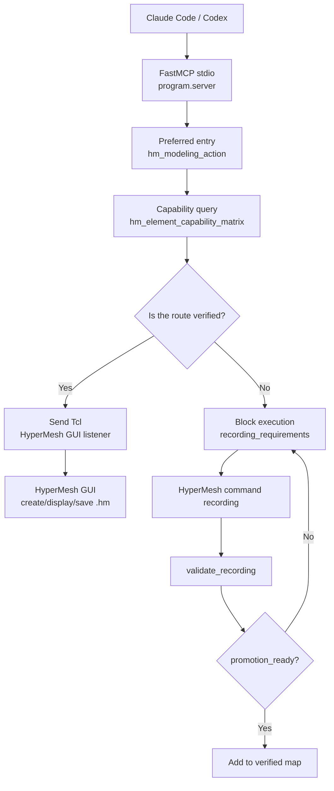

# Hyper-Dyna-MCP

<p align="center">
  <a href="./README.md"></a>
  <a href="./README.en.md"></a>
  <a href="./LICENSE"></a>
</p>

Hyper-Dyna-MCP is a local MCP server for driving a running HyperMesh GUI session. It integrates with Claude Code / Codex through `FastMCP + stdio` and sends verified Tcl routes to the HyperMesh GUI listener.

The current scope is HyperMesh GUI automation only. LS-DYNA solver execution, LS-PrePost, hmbatch, backend K writing, and K-file export are not active MCP execution capabilities.

## Current Status

- Version: `2.0.0`
- MCP transport: `FastMCP + stdio`
- Runtime target: local HyperMesh GUI listener
- Default port: `47883`
- Available FE creation: HEX8, TET4, QUAD4 shell, TRIA3, BAR2/BEAM, DISCRETE spring, MASS element
- Available geometry creation: surface plate, geometry solid box (verified `*solidblock` route)
- Available modeling actions: `assign_material`, `assign_property`, `assign_section`, `assign_eos`, `apply_constraint`, `apply_load`
- Blocked by default: `*tetmesh`, surface automesh, line mesh, mixed mesh, K export; complex cards (e.g. `MAT_3`, `LOAD_BLAST`) still require validation

## Workflow



## Quick Start

### 1. Register MCP

Let Claude Code / Codex start the server through stdio:

```json
{
  "mcpServers": {
    "hyper-dyna-mcp": {
      "command": "<python>",
      "args": ["-m", "program.server"],
      "cwd": "<repo-root>",
      "env": {
        "PYTHONPATH": "<repo-root>"
      }
    }
  }
}
```

This project is not a FastAPI/HTTP service. You do not need to keep a Web server running.

### 2. Start The HyperMesh Listener

Run this in the HyperMesh Tcl Console:

```tcl
set ::mcp_hm_port 47883
source "<repo-root>/runs/hm_gui_listener.tcl"
```

Success should return:

```text
HYPERMESH_MCP_PONG
```

If the port is occupied, use the fixed recovery port `47884`:

```tcl
catch {mcp_stop}
if {[llength [info commands mcp_start_on_port]]} {mcp_start_on_port 47884} else {source "<repo-root>/runs/hm_gui_listener_47884.tcl"}
```

### 3. Verify

Connected HyperMesh smoke:

```powershell
<python> -B -X utf8 -m program.claude_smoke --config <mcp-config.json> --with-gui --port 47883 --modeling-smoke
```

Local no-GUI check:

```powershell
<python> -B -X utf8 -m program.claude_smoke --config <mcp-config.json>
```

## Common Tools

Prefer these tools:

```text
hm_modeling_action
hm_element_capability_matrix
hm_command_map
hm_gui_modeling_smoke
hm_visual_refresh
hm_auto_save
check_hypermesh_connection
diagnose_hypermesh_listener
set_hypermesh_listener_port
```

Direct creation tools:

```text
hm_create_fe_cube
hm_create_surface_plate
hm_create_shell_plate
hm_create_tet4
hm_create_tria3
hm_create_beam_line
hm_create_discrete_spring
hm_create_lumped_mass
hm_create_solid_box
```

LS-DYNA keyword tools are for verified template execution, planning, and validation:

```text
dyna_keyword_policy
dyna_keyword_map_validate
dyna_keyword_query
hm_set_keyword
```

## Modeling Actions

`hm_modeling_action` is the preferred agent modeling entry point. It supports the following actions:

| Action | Function | Notes |
| --- | --- | --- |
| `create_mesh` | Create structured FE mesh | Verified routes: HEX8, QUAD4 shell |
| `create_element` | Create direct FE element | TET4, TRIA3, BAR2/BEAM, DISCRETE, MASS |
| `assign_material` | Assign material | Curated keywords: `MAT_ELASTIC`, etc. |
| `assign_property` | Assign property | Curated keywords: `SECTION_SOLID`, `SECTION_SHELL`, `SECTION_BEAM`, `SECTION_DISCRETE` |
| `assign_section` | Assign section | Same as assign_property |
| `assign_eos` | Assign EOS | Curated keywords: `EOS_LINEAR_POLYNOMIAL`, etc. |
| `apply_constraint` | Apply constraint | Curated keywords: `BOUNDARY_SPC`, `BOUNDARY_SPC_SET` |
| `apply_load` | Apply load | Curated keywords: `LOAD_NODE`, `LOAD_SEGMENT`, `LOAD_SHELL` and their set variants |
| `recording_requirements` | Inspect recording requirements | For blocked routes next step |
| `validate_recording` | Validate recording evidence | Promotion loop |

Material assignment capability matrix supports all element types: `solid_hex`, `solid_tet`, `shell_quad`, `shell_tria`, `line_beam`, `lumped_mass`, `discrete`.

## Curated Keyword List

LS-DYNA keywords currently executable through `hm_set_keyword`:

**Materials**

- `MAT_ELASTIC`

**Sections / Properties**

- `SECTION_SOLID`
- `SECTION_SHELL`
- `SECTION_BEAM`
- `SECTION_DISCRETE`

**EOS**

- `EOS_LINEAR_POLYNOMIAL`

**Constraints**

- `BOUNDARY_SPC`
- `BOUNDARY_SPC_SET`

**Loads**

- `LOAD_NODE`, `LOAD_NODE_SET`
- `LOAD_SEGMENT`, `LOAD_SEGMENT_SET`
- `LOAD_SHELL`, `LOAD_SHELL_SET`

Complex cards that are not curated remain blocked, e.g. `MAT_3`, `LOAD_BLAST`.

## Capability Scope

| Type | Current status |
| --- | --- |
| HEX8 structured FE | Available through a verified Tcl route |
| TET4 / TRIA3 direct element | Available, direct FE element only, not automesh |
| QUAD4 shell plate | Available, structured FE shell, no surface automesh |
| BAR2/BEAM line | Available, creates a new line and BEAM elements |
| DISCRETE / MASS | Available, basic FE element creation |
| Geometry surface | Available |
| Geometry solid | Available through verified `*solidblock` route |
| Material/property/section/EOS/constraints/LOAD | Available through `hm_set_keyword` GUI Tcl templates; complex cards still require validation |
| `*tetmesh` / surface automesh / line mesh / `mixed_mesh_workflow` | Not open, requires command recording |
| K export | Not open; backend K writer cannot replace GUI export |

FE mesh, geometry entities, and K files are separate routes. Agents must prefer the HyperMesh GUI listener and verified routes. `program.tools.k_writer`, `program.tools.k_parser`, and `program.tools.hm_k_integration` are offline fixture/test/review helpers only and must not bypass GUI modeling or pretend to be final `.k` export.

## Recording Validation

Unopened routes must not be implemented by guessing Tcl. Use this flow:

1. Call `hm_modeling_action(action="recording_requirements")` to inspect required evidence.
2. Record real Tcl in HyperMesh command recording.
3. Call `hm_modeling_action(action="validate_recording")` to validate recording and runtime evidence.
4. Add the route to the verified map only after `promotion_ready=true`.

## Local Validation

```powershell
<python> -B -X utf8 -m pytest
<python> -B -X utf8 -m program.claude_smoke --config <mcp-config.json>
```

## Key Files

```text
program/server.py                 MCP server entry
program/tools/hm_gui.py           GUI listener client and diagnostics
program/tools/hm_model_writer.py  FE modeling helpers
program/tools/hm_command_map.py   verified HyperMesh Tcl route map
program/tools/dyna_keyword_map.py structured LS-DYNA keyword policy
program/claude_smoke.py           MCP smoke test
runs/hm_gui_listener.tcl          HyperMesh Tcl listener
templates/hm_command_map.json     HyperMesh route definitions
templates/dyna_keyword_map.json   LS-DYNA keyword route definitions
```

## Boundaries

- Do not guess unverified HyperMesh Tcl commands.
- Do not execute LS-DYNA, LS-PrePost, or hmbatch from the current MCP surface.
- Do not use Dyna manual text or embeddings as execution authority.
- Do not use K writer/parser/integration to bypass HyperMesh GUI.
- Do not commit `.claude/`, `.codex/`, local MCP JSON, commercial software paths, tokens, proxies, or local path YAML.

## License

This project is licensed under the GNU Affero General Public License v3.0. See [LICENSE](LICENSE).
