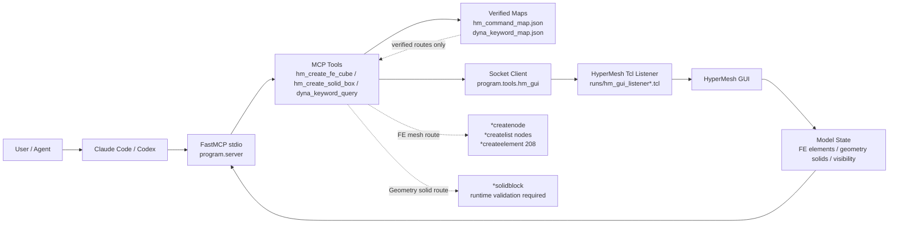

# Hyper-Dyna-MCP

<p align="center">
  <a href="./README.md"></a>
  <a href="./README.en.md"></a>
  <a href="./LICENSE"></a>
</p>

Hyper-Dyna-MCP is a local MCP server for driving a running HyperMesh GUI session from Claude Code or Codex. It uses `FastMCP + stdio` for agent integration, while Python orchestrates verified Tcl routes sent to the HyperMesh GUI listener.

The current scope is HyperMesh GUI automation only. LS-DYNA solver execution, LS-PrePost execution, and K-file export are outside the active MCP tool surface.

## ✅ Current Status

- Version: `1.0.0`
- MCP transport: `FastMCP + stdio`
- Runtime target: local HyperMesh GUI listener
- Tool surface: 32 HyperMesh-focused MCP tools
- FE route: verified structured HEX8 mesh route using `*createnode`, `*createlist nodes`, and `*createelement 208`
- Solid route: `*solidblock` has local script evidence and still needs runtime validation in the target HyperMesh GUI session
- Dyna keyword policy: structured MAP first; manual notes and embeddings are retrieval/explanation only

## 🎬 HyperMesh 2021 Demo Flow

This flow is based on a HyperMesh 2021 demonstration. The previous separate `source hmcustom.tcl` step has been removed from the README flow; keep the MCP server step and the HyperMesh listener/smoke step.

### Step 1: Register The MCP Server

The recommended path is to let Claude Code / Codex start `program.server` from the stdio MCP configuration. Do not run the stdio MCP server as a normal long-lived HTTP background service.

Local MCP registration example:

```json
{
  "mcpServers": {
    "hyper-dyna-mcp": {
      "command": "C:/path/to/conda/envs/hyper-dyna/python.exe",
      "args": ["-B", "-X", "utf8", "-m", "program.server"],
      "cwd": "C:/path/to/hyper-dyna-mcp"
    }
  }
}
```

Keep local MCP registration files outside Git. This repository ignores `.claude/`, `.codex/`, `claude_code_mcp*.json`, and machine-specific path configs.

For entrypoint debugging only, run:

```powershell
C:/path/to/conda/envs/hyper-dyna/python.exe -B -X utf8 -m program.server
```

### Step 2: Connect HyperMesh And Run Smoke

First call `start_hypermesh_gui_listener` from the MCP client to generate a Tcl listener file for the current machine. Then source the returned listener path in the HyperMesh Tcl Console, for example:

```tcl
source "C:/path/to/hyper-dyna-mcp/runs/hm_gui_listener.tcl"
```

Expected listener metadata includes:

```text
HYPERMESH_MCP_PONG
LISTENER_VERSION=2024-compat-v3
```

Then run the connected GUI smoke test:

```powershell
C:/path/to/conda/envs/hyper-dyna/python.exe -B -X utf8 -m program.claude_smoke --config C:/path/to/local-mcp-config.json --with-gui --port 47884 --modeling-smoke
```

If a stale listener or occupied port blocks the demo, use the generated port-specific listener:

```tcl
source "C:/path/to/hyper-dyna-mcp/runs/hm_gui_listener_47884.tcl"
```

## 🧭 Architecture Flow



## 🛠️ Main Tools

Common MCP tools:

```text
ping
check_environment
start_hypermesh_gui_listener
check_hypermesh_connection
diagnose_hypermesh_listener
set_hypermesh_listener_port
get_model_info
execute_tcl_gui
hm_auto_save
hm_check_model
hm_read_materials
hm_read_components
hm_set_keyword
hm_create_fe_cube
hm_create_solid_box
hm_visual_refresh
hm_gui_modeling_smoke
hm_command_map
dyna_keyword_policy
dyna_keyword_map_validate
dyna_keyword_query
hm_python_api_status
execute_hm_python_api
hm_python_api_current_model_info
```

## 🧱 FE Mesh vs Geometry Solid

`hm_create_fe_cube` creates finite-element mesh entities, not HyperMesh CAD solids. It uses the verified FE route:

```text
*createnode
*createlist nodes
*createelement 208
```

`hm_create_solid_box` is a separate geometry-solid route based on `*solidblock`. It must prove, in the target HyperMesh GUI session, that `solids_count` increases, the solid is visible in the GUI, and the listener returns a successful result.

Do not replace the FE route with the solid route. They create different entity types and have different validation gates.

## 📚 Dyna Keyword Policy

Dyna keyword support uses structured maps:

```text
keyword -> cardimage -> dataname -> fields -> examples -> manual_refs
```

Manual notes and embeddings are not execution sources. They are used only for explanation, retrieval, and review. A keyword route becomes executable only after HyperMesh cardimages and datanames are verified through command recording or a trusted local dictionary source.

## ✅ Validation

For local development:

```powershell
C:/path/to/conda/envs/hyper-dyna/python.exe -B -X utf8 -m pytest
```

MCP smoke:

```powershell
C:/path/to/conda/envs/hyper-dyna/python.exe -B -X utf8 -m program.claude_smoke --config C:/path/to/local-mcp-config.json
```

## ⚖️ License

This project is licensed under the GNU Affero General Public License v3.0. See [LICENSE](LICENSE).

## 🔐 Boundaries

- Do not guess unverified HyperMesh Tcl commands.
- Do not execute LS-DYNA or LS-PrePost from the active MCP surface.
- Do not use Dyna manual text or embeddings as execution authority.
- Do not commit `.claude/`, `.codex/`, local MCP JSON files, or machine-specific path YAML.
