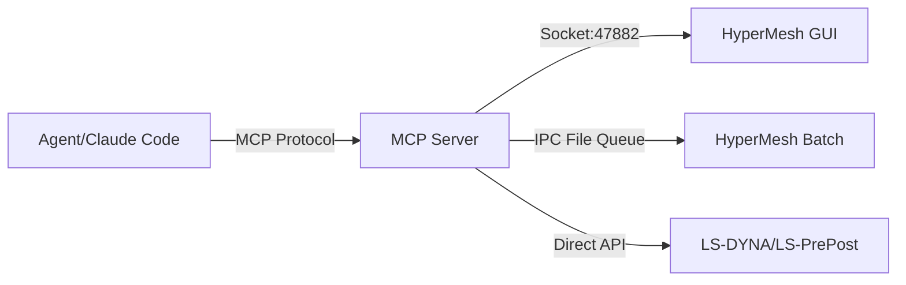
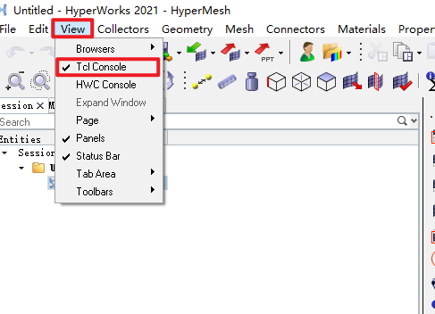
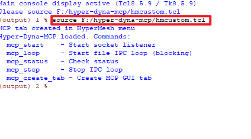
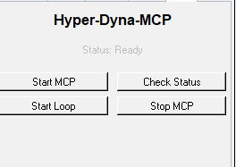
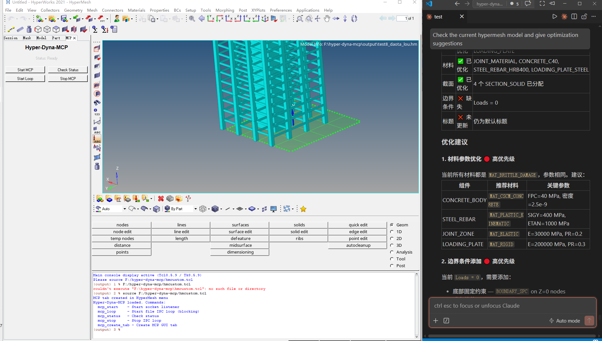
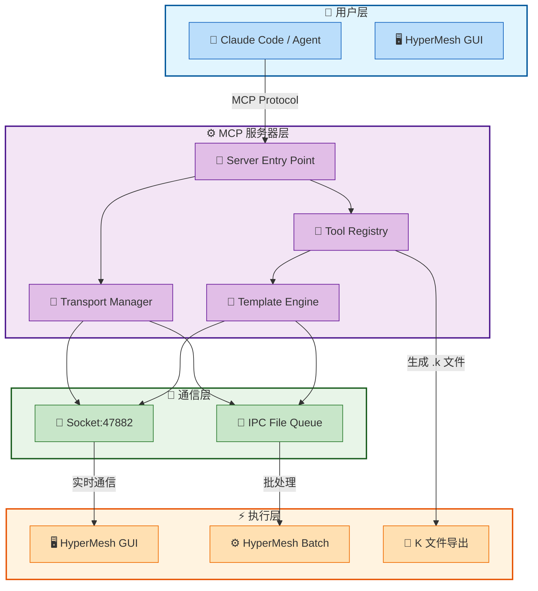

# 🏗️ Hyper-Dyna-MCP

<p align="center">
  <a href="./README.md"></a>
  <a href="./README.en.md"></a>
  <a href="./LICENSE"></a>
  <a href="https://github.com/hyper-dyna-mcp/releases"></a>
</p>

**Hyper-Dyna-MCP** 是一个基于 **MCP (Model Context Protocol)** 的 CAE 工作流自动化服务器，连接自然语言规划与 **HyperMesh** 前处理、**LS-DYNA** 关键字文件处理、**LS-PrePost** 后处理。

> 🎯 **核心目标**：让工程师通过自然语言描述，自动完成复杂的 CAE 前处理工作流。


## ✨ 功能特点

- 📚 **1935 个 LS-DYNA 关键字模板** — MAT、SECTION、CONTACT、BOUNDARY、LOAD、CONTROL、DATABASE、SET 等
- 🔗 **HyperMesh GUI 集成** — Socket 通信（端口 47882）+ IPC 文件队列双通道
- 📝 **K 文件导出** — 从 HyperMesh 模型导出 LS-DYNA .k 关键字文件
- 🔧 **模型操作** — 读写材料、属性、组件、截面等
- 🛡️ **安全策略** — Tcl 脚本策略强制执行、MCP_SCRIPT 标记、逐命令执行
- 🔄 **工作流编排** — LS-DYNA、HyperMesh 和混合流水线

## 🧩 接口类型

### MCP 协议接口

本项目实现标准 **MCP (Model Context Protocol)** 协议，支持：

- **工具调用 (Tools)** — 18 个专业 CAE 工具
- **提示词 (Prompts)** — 工作流规划、执行、验证
- **资源 (Resources)** — 路径配置、环境信息

### 通信接口



## 📦 安装方法

### 环境要求

- **Python**: 3.11+ (推荐 3.13)
- **HyperMesh**: 2021+
- **LS-DYNA**: R13+
- **LS-PrePost**: 4.8+
- **Conda**: 用于环境管理

### 快速安装（推荐）

使用批处理安装脚本，自动配置所有路径：

```bash
# Windows
install.bat

# Linux/macOS
chmod +x install.sh
./install.sh
```

或者使用交互式配置向导：

```bash
python batch/setup_wizard.py
```

### 手动安装

#### 1️⃣ 克隆仓库

```bash
git clone https://github.com/your-username/hyper-dyna-mcp.git
cd hyper-dyna-mcp
```

#### 2️⃣ 创建 Conda 环境

```bash
conda create -n hyper-dyna python=3.13
conda activate hyper-dyna
```

#### 3️⃣ 安装依赖

```bash
# 安装项目依赖
pip install -e .

# 或者安装开发依赖
pip install -e ".[dev]"
```

#### 4️⃣ 配置路径

编辑 `path/local_paths.yaml`：

```yaml
project:
  root: "."
  conda_env: "hyper-dyna"
  python_exe: "E:/anaconda3/anzhuang/envs/hyper-dyna/python.exe"
```

#### 5️⃣ 验证安装

```bash
# 运行测试
pytest

# 检查环境
python -c "from program.server import main; print('✅ MCP Server ready')"
```

## 🚀 使用方法

### 方式一：直接启动 MCP 服务器

```bash
# 启动 MCP 服务器
python -m program.server
```

### 方式二：通过 HyperMesh GUI（推荐）

#### Step 1：打开 Tcl 控制台

在 HyperMesh 中，通过菜单打开 Tcl 控制台：

**View → Tcl Console**



#### Step 2：加载 MCP 脚本

在 Tcl 控制台中输入以下命令加载 MCP 脚本：

```tcl
source hmcustom.tcl
```



#### Step 3：使用 MCP GUI 界面

加载脚本后，会自动创建 MCP 标签页，包含以下功能按钮：

- **Start MCP** - 启动 Socket 监听器
- **Check Status** - 检查连接状态
- **Start Loop** - 启动 IPC 文件循环
- **Stop MCP** - 停止 MCP 服务



#### Step 4：使用 Claude Code 进行模型检查

启动 MCP 后，可以使用 Claude Code 进行模型检查和问题诊断：

```bash
# 在 Claude Code 中
用户: 检查当前 HyperMesh 模型状态
Claude: 我将使用 hm_check_model 工具检查模型...
```



### HyperMesh 命令说明

`hmcustom.tcl` 提供以下命令：

| 命令 | 功能描述 |
|------|----------|
| `mcp_start` | 启动 MCP 监听器（调用 `runs/mcp.tcl`） |
| `mcp_loop` | 启动 IPC 文件循环（调用 `python -m program.plugin_loop`） |
| `mcp_status` | 检查 Socket 和 IPC 状态 |
| `mcp_stop` | 停止 IPC 循环（写入 `ipc/stop.flag`） |
| `mcp_create_tab` | 创建 MCP GUI 标签页（自动执行） |

### 启动方式

项目提供两种独立的启动方式：

**方式 A：Socket 监听器**
- 命令：`mcp_start`
- 功能：启动 HyperMesh 内置的 Socket 服务器，监听端口 47882
- 适用：需要与 MCP 服务器实时通信

**方式 B：IPC 文件循环**
- 命令：`mcp_loop`
- 功能：启动 Python 脚本，轮询 `ipc/commands/` 目录处理命令
- 适用：批处理模式或 Socket 不可用时

### 方式三：Claude Code 集成

在 Claude Code 中直接使用 MCP 工具：

```
用户: 帮我创建一个混凝土柱的 LS-DYNA 模型
Claude: 我将使用 Hyper-Dyna-MCP 工具为您创建模型...
```

## 🔧 MCP 工具列表

### 核心工具 (18 个)

| 工具名称 | 功能描述 | 接口类型 |
|----------|----------|----------|
| `hm_set_keyword` | 设置 LS-DYNA 关键字 | Socket/IPC |
| `hm_keyword_help` | 获取关键字帮助 | 本地查询 |
| `hm_check_model` | 查询当前模型状态 | Socket/IPC |
| `hm_convert_model` | 转换模型为 LS-DYNA 格式 | Socket/IPC |
| `hm_read_materials` | 读取所有材料 | Socket/IPC |
| `hm_read_components` | 读取所有组件 | Socket/IPC |
| `execute_tcl_gui` | 在 HyperMesh GUI 中执行 Tcl | Socket |
| `execute_hmbatch` | 通过 hmbatch.exe 执行 | IPC |
| `generate_tcl_script` | 生成 Tcl 脚本 | 本地生成 |
| `check_hypermesh_connection` | 检查 hmbatch.exe 连接 | 本地检查 |
| `parse_k_file` | 解析 .k 文件 | 本地解析 |
| `write_k_file` | 生成 .k 文件 | 本地生成 |
| `generate_lsdyna_command` | 生成求解器命令（dry_run） | 本地生成 |
| `parse_solver_log` | 解析求解器日志 | 本地解析 |
| `execute_lsprepost` | 执行 LS-PrePost cfile | 直接调用 |
| `generate_cfile` | 生成 cfile 脚本 | 本地生成 |
| `generate_post_processing_cfile` | 生成后处理 cfile | 本地生成 |
| `check_environment` | 检查 Python/conda/包 | 本地检查 |
| `load_path_config` | 加载 YAML 配置 | 本地加载 |
| `validate_path` | 检查路径是否存在 | 本地检查 |

## 🏗️ 项目结构

```
hyper-dyna-mcp/
├── 📁 program/                    # MCP 服务器核心
│   ├── 🐍 server.py              # MCP 入口点（18 个工具）
│   ├── 🔄 transport_manager.py   # Socket/IPC 双通道管理
│   ├── 📨 plugin_loop.py         # IPC 命令分发器
│   └── 🛠️ tools/                 # 24 个工具模块
│       ├── hm_gui.py             # HyperMesh GUI 通信
│       ├── hm_runner.py          # HyperMesh 批处理
│       ├── k_parser.py           # K 文件解析器
│       ├── k_writer.py           # K 文件生成器
│       └── ...                   # 其他工具
├── 📁 templates/keyword/         # 1935 个 Tcl 模板
│   ├── mat/                      # 材料模板
│   ├── section/                  # 截面模板
│   ├── contact/                  # 接触模板
│   └── ...                       # 其他关键字
├── 📁 path/                      # YAML 配置文件
├── 📁 tests/                     # 132 个测试
├── 📁 docs/                      # 文档
├── 📁 output/                    # 生成的模型文件
├── 📄 hmcustom.tcl               # HyperMesh 自动加载脚本
└── 📄 pyproject.toml             # 项目配置
```

## 📊 技术架构



## 📈 性能指标

- **关键字模板**: 1935 个
- **工具数量**: 18 个
- **测试覆盖**: 132 个测试用例
- **连接延迟**: Socket < 10ms, IPC < 500ms
- **模型处理**: 支持 100MB+ .k 文件

## 🧪 测试

```bash
# 运行所有测试
pytest

# 运行特定测试
pytest tests/test_minimum_model.py

# 生成覆盖率报告
pytest --cov=program --cov-report=html
```

## 📚 文档

- 📖 [API 文档](./docs/api.md)
- 🏗️ [架构设计](./docs/architecture.md)
- 🔧 [工具参考](./docs/tools.md)
- 📝 [示例工作流](./docs/examples.md)
- 📦 [Batch 配置指南](./batch/README.md)

## 🤝 贡献指南

欢迎贡献！请遵循以下步骤：

1. Fork 本仓库
2. 创建特性分支 (`git checkout -b feature/amazing-feature`)
3. 提交更改 (`git commit -m 'Add amazing feature'`)
4. 推送到分支 (`git push origin feature/amazing-feature`)
5. 创建 Pull Request

## 📋 版本历史

### v0.1.0 (当前版本)

- ✅ MCP 服务器核心架构
- ✅ 18 个 CAE 工具实现
- ✅ 1935 个 LS-DYNA 关键字模板
- ✅ HyperMesh GUI 集成
- ✅ Socket/IPC 双通道通信
- ✅ K 文件解析/生成
- ✅ 132 个测试用例
- ✅ Batch 配置系统（支持从个人版到大众版）

## 📄 许可证

本项目采用 [MIT License](./LICENSE)。

## 🙏 致谢

- [LS-DYNA](https://www.lstc.com/) — 有限元求解器
- [HyperMesh](https://www.altair.com/hypermesh/) — 前处理软件
- [MCP Protocol](https://modelcontextprotocol.io/) — 模型上下文协议

## 📞 联系方式

- **Issues**: [GitHub Issues](https://github.com/your-username/hyper-dyna-mcp/issues)
- **Discussions**: [GitHub Discussions](https://github.com/your-username/hyper-dyna-mcp/discussions)

---

<p align="center">
  Made with ❤️ for CAE Engineers
</p>
