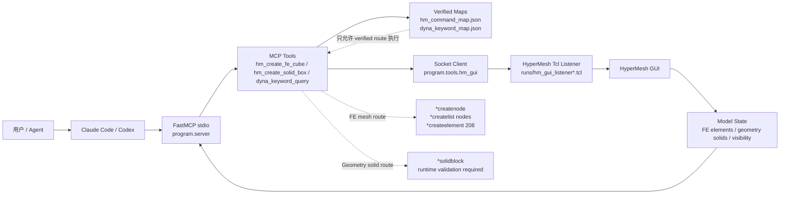

# Hyper-Dyna-MCP

<p align="center">
  <a href="./README.md"></a>
  <a href="./README.en.md"></a>
  <a href="./LICENSE"></a>
</p>

Hyper-Dyna-MCP 是一个面向本机 HyperMesh GUI 的 MCP server。它通过 `FastMCP + stdio` 接入 Claude Code / Codex，再由 Python 编排层把经过验证的 Tcl 路线发送到正在运行的 HyperMesh GUI listener。

当前版本聚焦 HyperMesh GUI 自动化。LS-DYNA 求解器执行、LS-PrePost 执行和 K 文件导出不属于当前 MCP 工具面。

## ✅ 当前状态

- 版本：`1.0.0`
- MCP 传输：`FastMCP + stdio`
- 运行目标：本机 HyperMesh GUI listener
- 工具数量：32 个 HyperMesh 相关 MCP tools
- FE 路线：已验证的结构化 HEX8 网格路线，使用 `*createnode`、`*createlist nodes`、`*createelement 208`
- Solid 路线：`*solidblock` 已有本机脚本证据，仍需要目标 HyperMesh GUI session 的 runtime validation
- Dyna keyword：结构化 MAP 优先，manual notes / embedding 只用于解释和检索，不作为执行依据

## 🎬 HyperMesh 2021 演示流程

以下流程基于 HyperMesh 2021 演示。README 中已删除单独 `source hmcustom.tcl` 的步骤，只保留 MCP server 启动和 HyperMesh listener/smoke 两步。

### Step 1: 注册 MCP Server

推荐方式是让 Claude Code / Codex 通过 stdio MCP 配置自动启动 `program.server`。不要把 stdio MCP server 当成普通后台 HTTP 服务手动常驻运行。

本机 MCP 注册示例：

```json
{
  "mcpServers": {
    "hyper-dyna-mcp": {
      "command": "C:/path/to/conda/envs/hyper-dyna/python.exe",
      "args": ["-B", "-X", "utf8", "-m", "program.server"],
      "cwd": "C:/path/to/hyper-dyna-mcp"
    }
  }
}
```

本机 MCP 注册文件不要提交到 Git。仓库已忽略 `.claude/`、`.codex/`、`claude_code_mcp*.json` 和本机路径配置。

仅调试 server 入口时可手动运行：

```powershell
C:/path/to/conda/envs/hyper-dyna/python.exe -B -X utf8 -m program.server
```

### Step 2: 连接 HyperMesh 并运行 Smoke

在 MCP client 中先调用 `start_hypermesh_gui_listener`，生成当前机器可用的 Tcl listener 文件。然后在 HyperMesh Tcl Console 中 source 工具返回的 listener 路径，例如：

```tcl
source "C:/path/to/hyper-dyna-mcp/runs/hm_gui_listener.tcl"
```

预期 listener metadata 包含：

```text
HYPERMESH_MCP_PONG
LISTENER_VERSION=2024-compat-v3
```

然后运行连接 HyperMesh GUI 的 smoke test：

```powershell
C:/path/to/conda/envs/hyper-dyna/python.exe -B -X utf8 -m program.claude_smoke --config C:/path/to/local-mcp-config.json --with-gui --port 47884 --modeling-smoke
```

如果旧 listener 或端口占用影响演示，可使用端口专用 listener：

```tcl
source "C:/path/to/hyper-dyna-mcp/runs/hm_gui_listener_47884.tcl"
```

## 🧭 架构流程



## 🛠️ 主要工具

常用 MCP tools：

```text
ping
check_environment
start_hypermesh_gui_listener
check_hypermesh_connection
diagnose_hypermesh_listener
set_hypermesh_listener_port
get_model_info
execute_tcl_gui
hm_auto_save
hm_check_model
hm_read_materials
hm_read_components
hm_set_keyword
hm_create_fe_cube
hm_create_solid_box
hm_visual_refresh
hm_gui_modeling_smoke
hm_command_map
dyna_keyword_policy
dyna_keyword_map_validate
dyna_keyword_query
hm_python_api_status
execute_hm_python_api
hm_python_api_current_model_info
```

## 🧱 FE 网格与几何 Solid

`hm_create_fe_cube` 创建的是有限元网格实体，不是 HyperMesh CAD solid。它使用已验证的 FE 路线：

```text
*createnode
*createlist nodes
*createelement 208
```

`hm_create_solid_box` 是独立的 geometry solid 路线，基于 `*solidblock`。它必须在目标 HyperMesh GUI session 中证明：

- `solids_count` 增加
- GUI 中 solid 可见
- listener 返回成功结果

不要把 FE 路线替换成 solid 路线。两者创建的实体类型不同，验证门槛也不同。

## 📚 Dyna Keyword 策略

Dyna keyword 支持采用结构化 MAP：

```text
keyword -> cardimage -> dataname -> fields -> examples -> manual_refs
```

manual notes 和 embedding 只用于解释、检索和审查。只有当 HyperMesh cardimage 与 dataname 通过 command recording 或可信本地字典验证后，对应 keyword route 才能进入可执行状态。

关键文件：

```text
templates/dyna_keyword_map.json
templates/dyna_manual_notes.jsonl
templates/hm_command_map.json
templates/hm_dictionary.json
templates/keyword_index.json
```

## ✅ 验证

本地开发可运行：

```powershell
C:/path/to/conda/envs/hyper-dyna/python.exe -B -X utf8 -m pytest
```

MCP smoke：

```powershell
C:/path/to/conda/envs/hyper-dyna/python.exe -B -X utf8 -m program.claude_smoke --config C:/path/to/local-mcp-config.json
```

## 📁 关键路径

```text
program/server.py                 MCP server entry
program/tools/hm_gui.py           GUI listener client and diagnostics
program/tools/hm_model_writer.py  FE and solid modeling tools
program/tools/hm_command_map.py   verified HyperMesh Tcl route map
program/tools/dyna_keyword_map.py structured Dyna keyword policy
program/claude_smoke.py           Claude/Codex MCP smoke test
hmcustom.tcl                      optional HyperMesh Tcl helper
templates/hm_command_map.json     HyperMesh route definitions
templates/dyna_keyword_map.json   Dyna keyword route definitions
```

本机路径应放在被忽略的 `path/*.yaml` 或私有 MCP config 中。不要提交商业软件路径、用户 vault 路径、token、proxy 或 agent session state。

## ⚖️ 许可证

本项目使用 GNU Affero General Public License v3.0，见 [LICENSE](LICENSE)。

## 🔐 边界

- 不猜测未验证的 HyperMesh Tcl 命令
- 不从当前 MCP 工具面执行 LS-DYNA 或 LS-PrePost
- 不把 Dyna manual 文本或 embedding 作为执行依据
- 不提交 `.claude/`、`.codex/`、本机 MCP JSON 或机器专属 path YAML
