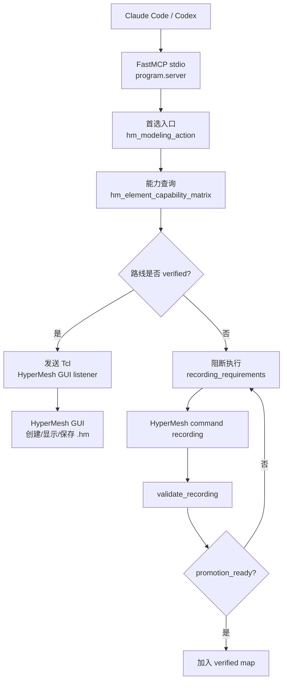

# Hyper-Dyna-MCP

<p align="center">
  <a href="./README.md"></a>
  <a href="./README.en.md"></a>
  <a href="./LICENSE"></a>
</p>

Hyper-Dyna-MCP 是一个面向本机 HyperMesh GUI 的 MCP server。它通过 `FastMCP + stdio` 接入 Claude Code / Codex，并把经过验证的 Tcl 路线发送到正在运行的 HyperMesh GUI listener。

当前范围只包含 HyperMesh GUI 自动化。LS-DYNA 求解器、LS-PrePost、hmbatch、后端写 K 文件和 K 文件导出都不是当前 MCP 执行能力。

## 当前状态

- 版本：`2.0.0`
- MCP 传输：`FastMCP + stdio`
- 运行目标：本机 HyperMesh GUI listener
- 默认端口：`47883`
- 可用 FE 创建：HEX8、TET4、QUAD4 shell、TRIA3、BAR2/BEAM、DISCRETE spring、MASS element
- 可用几何创建：surface plate
- 可用 geometry solid box：verified `*solidblock` route
- 默认阻断：`*tetmesh`、surface automesh、line mesh、mixed mesh、K export；基础材料/section/EOS/约束/LOAD 通过 GUI Tcl 模板开放

## 工作流程



## 快速使用

### 1. 注册 MCP

让 Claude Code / Codex 通过 stdio 启动：

```json
{
  "mcpServers": {
    "hyper-dyna-mcp": {
      "command": "<python>",
      "args": ["-m", "program.server"],
      "cwd": "<repo-root>",
      "env": {
        "PYTHONPATH": "<repo-root>"
      }
    }
  }
}
```

本项目不是 FastAPI/HTTP 服务，不需要手动常驻 Web server。

### 2. 启动 HyperMesh Listener

在 HyperMesh Tcl Console 中执行：

```tcl
set ::mcp_hm_port 47883
source "<repo-root>/runs/hm_gui_listener.tcl"
```

成功时应能收到：

```text
HYPERMESH_MCP_PONG
```

如果端口被占用，使用固定恢复端口 `47884`：

```tcl
catch {mcp_stop}
if {[llength [info commands mcp_start_on_port]]} {mcp_start_on_port 47884} else {source "<repo-root>/runs/hm_gui_listener_47884.tcl"}
```

### 3. 验证

连接 HyperMesh 的 smoke：

```powershell
<python> -B -X utf8 -m program.claude_smoke --config <mcp-config.json> --with-gui --port 47883 --modeling-smoke
```

只做本地 no-GUI 检查：

```powershell
<python> -B -X utf8 -m program.claude_smoke --config <mcp-config.json>
```

## 常用工具

优先使用：

```text
hm_modeling_action
hm_element_capability_matrix
hm_command_map
hm_gui_modeling_smoke
hm_visual_refresh
hm_auto_save
check_hypermesh_connection
diagnose_hypermesh_listener
set_hypermesh_listener_port
```

直接创建工具：

```text
hm_create_fe_cube
hm_create_surface_plate
hm_create_shell_plate
hm_create_tet4
hm_create_tria3
hm_create_beam_line
hm_create_discrete_spring
hm_create_lumped_mass
```

LS-DYNA keyword 查询只用于规划和校验：

```text
dyna_keyword_policy
dyna_keyword_map_validate
dyna_keyword_query
hm_set_keyword
```

## 功能范围

| 类型 | 当前状态 |
| --- | --- |
| HEX8 structured FE | 可用，走 verified Tcl route |
| TET4 / TRIA3 direct element | 可用，只创建直接 FE element，不是自动网格 |
| QUAD4 shell plate | 可用，结构化 FE shell，不做 surface automesh |
| BAR2/BEAM line | 可用，创建新直线和 BEAM element |
| DISCRETE / MASS | 可用，基础 FE element 创建 |
| Geometry surface | 可用 |
| Geometry solid box | 可用，走 verified `*solidblock` route |
| `*tetmesh` / surface automesh / line mesh / `mixed_mesh_workflow` | 未开放，需要 command recording |
| 基础材料、property/section、EOS、约束、LOAD | 可用，走 `hm_set_keyword` GUI Tcl 模板；复杂卡片仍需验证 |
| K export | 未开放，不能用后端 K writer 代替 GUI 导出 |

FE 网格、几何实体和 K 文件是不同路线。Agent 必须优先走 HyperMesh GUI listener 和 verified route；`program.tools.k_writer`、`program.tools.k_parser`、`program.tools.hm_k_integration` 只能作为离线 fixture/test/review，不能绕过 GUI 建模或伪装成最终 `.k` 导出。

## 录制验证

未开放路线不能靠猜 Tcl 实现。流程是：

1. 用 `hm_modeling_action(action="recording_requirements")` 查看需要的证据。
2. 在 HyperMesh 中用 command recording 录制真实 Tcl。
3. 用 `hm_modeling_action(action="validate_recording")` 校验 recording 和 runtime evidence。
4. 只有 `promotion_ready=true` 后，才能把路线加入 verified map。

## 本地验证

```powershell
<python> -B -X utf8 -m pytest
<python> -B -X utf8 -m program.claude_smoke --config <mcp-config.json>
```

## 关键文件

```text
program/server.py                 MCP server entry
program/tools/hm_gui.py           GUI listener client and diagnostics
program/tools/hm_model_writer.py  FE modeling helpers
program/tools/hm_command_map.py   verified HyperMesh Tcl route map
program/tools/dyna_keyword_map.py structured LS-DYNA keyword policy
program/claude_smoke.py           MCP smoke test
runs/hm_gui_listener.tcl          HyperMesh Tcl listener
templates/hm_command_map.json     HyperMesh route definitions
templates/dyna_keyword_map.json   LS-DYNA keyword route definitions
```

## 边界

- 不猜测未验证的 HyperMesh Tcl 命令。
- 不通过当前 MCP 执行 LS-DYNA、LS-PrePost 或 hmbatch。
- 不把 Dyna manual 文本或 embedding 当作执行依据。
- 不用 K writer/parser/integration 绕过 HyperMesh GUI。
- 不提交 `.claude/`、`.codex/`、本机 MCP JSON、商业软件路径、token、proxy 或本机 path YAML。

## 许可证

本项目使用 GNU Affero General Public License v3.0，见 [LICENSE](LICENSE)。
